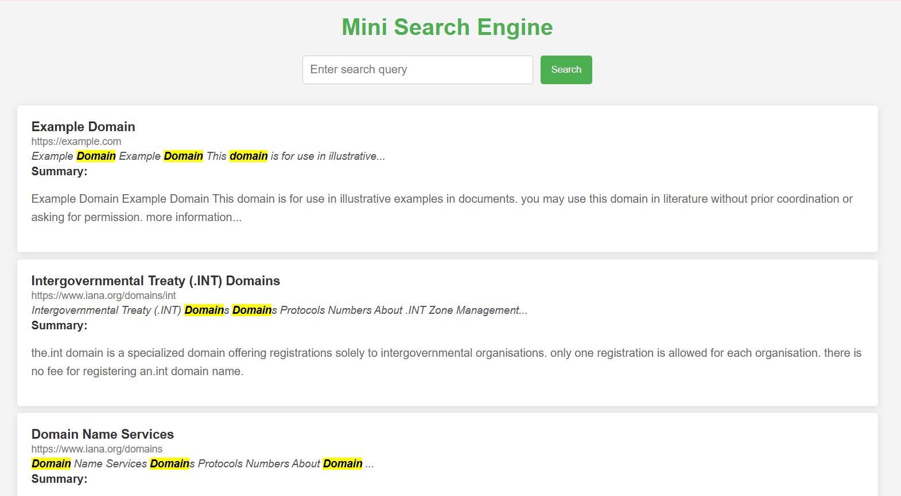

# 🕵️‍♂️ Mini Search Engine with Flask, TF-IDF & T5 Summarization

This is a mini search engine built using Flask that crawls web pages, indexes the content, and provides search functionality with ranking and summarization using machine learning (TF-IDF and T5 Transformer).

---

## 🚀 Features

- 🌐 **Web Crawler**: Starts from a seed URL and crawls up to a specified number of pages.
- 🧠 **TF-IDF Search Ranking**: Uses scikit-learn’s `TfidfVectorizer` to rank relevant documents based on user queries.
- ✂️ **Snippet Generator**: Highlights matching query terms in the search result.
- 📝 **Text Summarization**: Generates concise summaries using Hugging Face’s T5 model.
- 🔍 **Autocomplete**: Provides query suggestions based on crawled data.
- 💾 **SQLite Database**: Stores crawled data for efficient querying.

---

